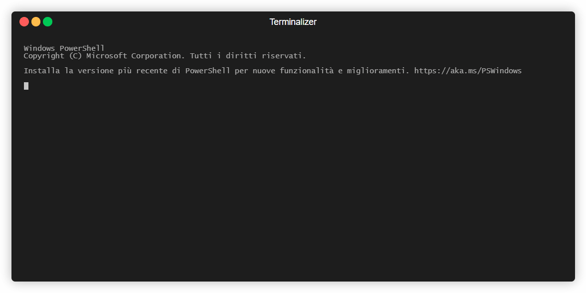

# Datapack Installer



This CLI app allows you to search datapacks on Planet-Minecraft(PMC) and install them, 

If a resource pack is needed, it will also download the resource pack in the `resourcepacks` in your `.minecraft` folder 

## Installation

Install it globally with

```bash
  npm install -g datapack-installer
```
or use it on the fly with npx

```bash
 npx datapack-installer install <datapack name>
```
## Usage

```bash
datapack-installer install <datapack name>
```
or use a PlanetMinecraft Link

```bash
datapack-installer install -l <pmc url link>
```
## Examples

```bash
datapack-installer install "mining device"
```
```bash
datapack-installer install -l "https://www.planetminecraft.com/data-pack/mining-device/"
```

## Authors

- [@macro21KGB](https://mariodeluca.netlify.app/)

